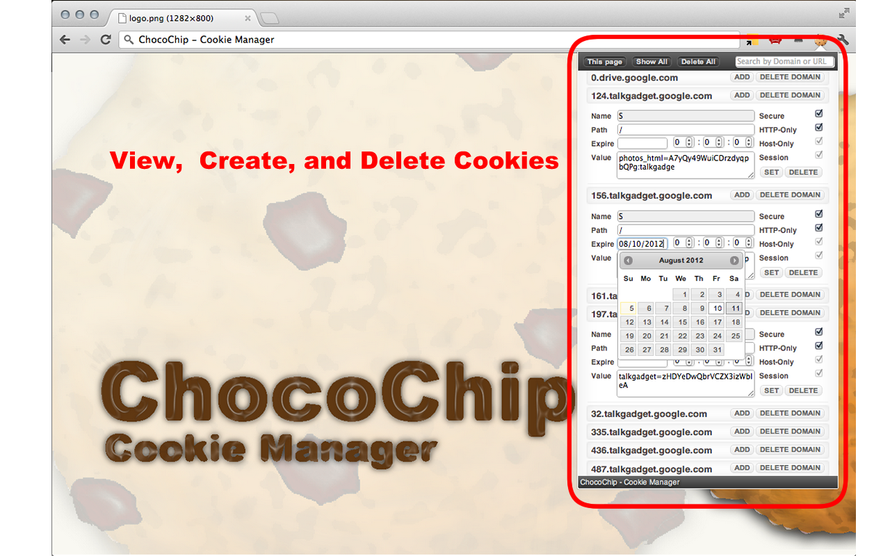

#  ChocoChip - Cookie Manager

## Description
`ChocoChip` is a [**Chrome Extension**](https://developer.chrome.com/docs/webstore) for quickly and easily managing cookies in the Chrome Web Browser

## Main Features
Developed by [**Yuji Kosuga**](https://github.com/yujikosuga) and updated by [**Jorge Serrano**](https://github.com/J0rgeSerran0/), the extension has the next main features:

> [!IMPORTANT]  
> $${\\color{#cc80ff}★}$$ Search cookies by domain or URL
> 
> $${\\color{#cc80ff}★}$$ Show cookies of the current page or all in your browser
> 
> $${\\color{#cc80ff}★}$$ Create new cookies and edit existing ones
> 
> $${\\color{#cc80ff}★}$$ Delete all cookies or some by a domain at once

## Release Notes
> [!TIP]
> $${\\color{green}★}$$ You can find the extension in the **DevTools** category

* $${\\color{red}v0.1.7}$$ published in `2012`, was removed by Google because it was using the manifest v2 of Google
* $${\\color{red}v0.2.0}$$ - `29/09/2025`. It implements the manifest v3 of Google, and has included a fix with a method deprecated at Google Chrome
* $${\\color{blue}v0.3.0}$$ - `03/10/2025`. Fixed some deprecated CSS  features. Improvements related with the UX

## Download
* [ChocoChip - Cookie Manager](https://chromewebstore.google.com/detail/chocochip-cookie-manager/cdllihdpcibkhhkidaicoeeiammjkokm?hl=en)

## Feedback
> [!NOTE]  
> $${\\color{blue}★}$$ Feedback and rating is always welcome [at its Chrome Web Store](http://goo.gl/hHAeE)
